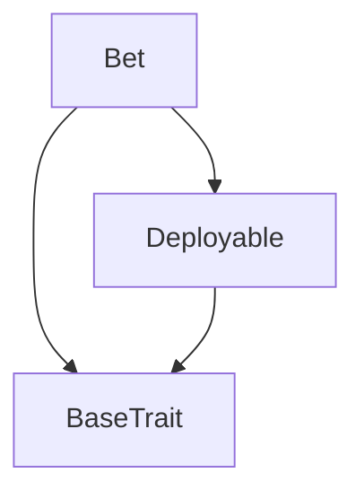
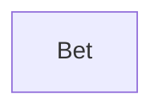

# TACT Compilation Report
Contract: Bet
BOC Size: 5105 bytes

# Types
Total Types: 27

## StateInit
TLB: `_ code:^cell data:^cell = StateInit`
Signature: `StateInit{code:^cell,data:^cell}`

## StdAddress
TLB: `_ workchain:int8 address:uint256 = StdAddress`
Signature: `StdAddress{workchain:int8,address:uint256}`

## VarAddress
TLB: `_ workchain:int32 address:^slice = VarAddress`
Signature: `VarAddress{workchain:int32,address:^slice}`

## Context
TLB: `_ bounced:bool sender:address value:int257 raw:^slice = Context`
Signature: `Context{bounced:bool,sender:address,value:int257,raw:^slice}`

## SendParameters
TLB: `_ bounce:bool to:address value:int257 mode:int257 body:Maybe ^cell code:Maybe ^cell data:Maybe ^cell = SendParameters`
Signature: `SendParameters{bounce:bool,to:address,value:int257,mode:int257,body:Maybe ^cell,code:Maybe ^cell,data:Maybe ^cell}`

## Deploy
TLB: `deploy#946a98b6 queryId:uint64 = Deploy`
Signature: `Deploy{queryId:uint64}`

## DeployOk
TLB: `deploy_ok#aff90f57 queryId:uint64 = DeployOk`
Signature: `DeployOk{queryId:uint64}`

## FactoryDeploy
TLB: `factory_deploy#6d0ff13b queryId:uint64 cashback:address = FactoryDeploy`
Signature: `FactoryDeploy{queryId:uint64,cashback:address}`

## Goal
TLB: `_ id:uint256 name:^string description:^string requiredStake:uint256 creator:address completed:bool participants:dict<uint256, address> participantsCount:uint256 taskCount:uint256 goalType:int257 isParticipant:dict<address, bool> isClaimed:dict<address, bool> completedTaskCount:dict<address, uint256> rewards:dict<address, uint256> = Goal`
Signature: `Goal{id:uint256,name:^string,description:^string,requiredStake:uint256,creator:address,completed:bool,participants:dict<uint256, address>,participantsCount:uint256,taskCount:uint256,goalType:int257,isParticipant:dict<address, bool>,isClaimed:dict<address, bool>,completedTaskCount:dict<address, uint256>,rewards:dict<address, uint256>}`

## GoalInfo
TLB: `_ id:uint256 name:^string description:^string requiredStake:uint256 creator:address completed:bool participants:dict<uint256, address> goalType:int257 = GoalInfo`
Signature: `GoalInfo{id:uint256,name:^string,description:^string,requiredStake:uint256,creator:address,completed:bool,participants:dict<uint256, address>,goalType:int257}`

## Task
TLB: `_ id:^string name:^string completed:bool projectId:^string taskCompleter:address = Task`
Signature: `Task{id:^string,name:^string,completed:bool,projectId:^string,taskCompleter:address}`

## Project
TLB: `_ id:^string userPoints:dict<address, uint256> participants:dict<uint256, address> participantsCount:uint256 = Project`
Signature: `Project{id:^string,userPoints:dict<address, uint256>,participants:dict<uint256, address>,participantsCount:uint256}`

## UserGoals
TLB: `_ address:address goals:dict<uint256, uint256> goalsLen:uint256 = UserGoals`
Signature: `UserGoals{address:address,goals:dict<uint256, uint256>,goalsLen:uint256}`

## CompletedTasks
TLB: `_ address:address tasks:dict<uint256, uint256> tasksLen:uint256 = CompletedTasks`
Signature: `CompletedTasks{address:address,tasks:dict<uint256, uint256>,tasksLen:uint256}`

## GithubUser
TLB: `_ githubUsername:^string = GithubUser`
Signature: `GithubUser{githubUsername:^string}`

## LinkWallet
TLB: `link_wallet#6f2239f5 address:address github:^string = LinkWallet`
Signature: `LinkWallet{address:address,github:^string}`

## CreateGoal
TLB: `create_goal#99f62b08 goalType:int257 name:^string description:^string requiredStake:int257 taskCount:int257 = CreateGoal`
Signature: `CreateGoal{goalType:int257,name:^string,description:^string,requiredStake:int257,taskCount:int257}`

## StakeAndUnlockGoal
TLB: `stake_and_unlock_goal#5e0b1ee7 goalId:int257 = StakeAndUnlockGoal`
Signature: `StakeAndUnlockGoal{goalId:int257}`

## ConfirmTaskCompletion
TLB: `confirm_task_completion#9811a72c goalId:int257 user:address = ConfirmTaskCompletion`
Signature: `ConfirmTaskCompletion{goalId:int257,user:address}`

## ClaimStake
TLB: `claim_stake#71cb1ece goalId:int257 = ClaimStake`
Signature: `ClaimStake{goalId:int257}`

## SettleGoal
TLB: `settle_goal#2ecbb389 goalId:int257 = SettleGoal`
Signature: `SettleGoal{goalId:int257}`

## CreateProject
TLB: `create_project#f7d126b3 projectId:^string name:^string = CreateProject`
Signature: `CreateProject{projectId:^string,name:^string}`

## CreateTask
TLB: `create_task#a62b9ce2 id:^string name:^string projectId:^string = CreateTask`
Signature: `CreateTask{id:^string,name:^string,projectId:^string}`

## ConfirmTask
TLB: `confirm_task#2dc00b3d taskId:^string github:^string taskPoints:int257 = ConfirmTask`
Signature: `ConfirmTask{taskId:^string,github:^string,taskPoints:int257}`

## DonateToProject
TLB: `donate_to_project#7fada449 projectId:^string amount:int257 = DonateToProject`
Signature: `DonateToProject{projectId:^string,amount:int257}`

## ClaimReward
TLB: `claim_reward#47fa4d67 projectId:^string = ClaimReward`
Signature: `ClaimReward{projectId:^string}`

## Bet$Data
TLB: `null`
Signature: `null`

# Get Methods
Total Get Methods: 14

## walletToGithub

## allGoals

## userGoals
Argument: address

## goalDetails
Argument: goalId

## allTasks

## unconfirmedTasks

## allProjectIds

## projectParticipants
Argument: projectId

## projectUserPoints
Argument: projectId
Argument: user

## totalRewards
Argument: user

## claimedRewards
Argument: user

## userPoints
Argument: user

## userCompletedTasks
Argument: user

## githubByWallet
Argument: wallet

# Error Codes
2: Stack underflow
3: Stack overflow
4: Integer overflow
5: Integer out of expected range
6: Invalid opcode
7: Type check error
8: Cell overflow
9: Cell underflow
10: Dictionary error
11: 'Unknown' error
12: Fatal error
13: Out of gas error
14: Virtualization error
32: Action list is invalid
33: Action list is too long
34: Action is invalid or not supported
35: Invalid source address in outbound message
36: Invalid destination address in outbound message
37: Not enough TON
38: Not enough extra-currencies
39: Outbound message does not fit into a cell after rewriting
40: Cannot process a message
41: Library reference is null
42: Library change action error
43: Exceeded maximum number of cells in the library or the maximum depth of the Merkle tree
50: Account state size exceeded limits
128: Null reference exception
129: Invalid serialization prefix
130: Invalid incoming message
131: Constraints error
132: Access denied
133: Contract stopped
134: Invalid argument
135: Code of a contract was not found
136: Invalid address
137: Masterchain support is not enabled for this contract
16969: Task already exists.
32038: Goal does not exist.
44355: Wallet already linked to a Github account
50111: Project already exists.

# Trait Inheritance Diagram

# Contract Dependency Diagram

